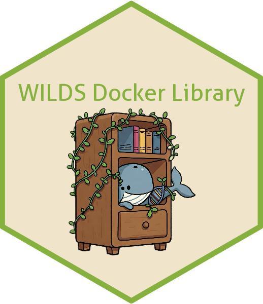

<table>
<tr>
  <td></td>
  <td>
    <h1>WILDS Docker Library</h1>
    <p>Curated collection of Docker images for reproducible bioinformatics workflows in the WILDS.</p>
  </td>
</tr>
</table>

[](https://getwilds.org/badges/#prototype)
[](https://opensource.org/licenses/MIT)

## Overview

The WILDS Docker Library is a centralized repository of Docker images maintained by the Fred Hutch Data Science Lab (DaSL) for use in bioinformatics and computational workflows. This repository hosts Dockerfiles for a wide range of bioinformatics tools, ensuring consistent, reproducible, and secure environments for research workflows.

Each tool has its own directory with:
- Dockerfiles for specific versions
- Comprehensive documentation
- Security vulnerability reports
- Usage examples

## Available Tools

The repository includes Docker images for popular bioinformatics tools including (but not limited to):

| Tool | Description | Available Versions |
|------|-------------|-------------------|
| AnnotSV | Structural variant annotation | 3.4.4, latest |
| ANNOVAR | Functional annotation of genetic variants | hg19, hg38, latest |
| AWS CLI | Amazon Web Services command line interface | 2.27.49, latest |
| BCFtools | VCF/BCF manipulation | 1.11, 1.19, latest |
| BEDOPS | High-performance genomic interval operations toolkit | 2.4.42, latest |
| bedparse | Python module and CLI tool for BED file operations | 0.2.3, latest |
| BEDtools | Genome arithmetic toolkit | 2.31.1, latest |
| biobambam2 | Tools for SAM/BAM processing | 2.0.185, latest |
| BWA | Burrows-Wheeler Aligner | 0.7.17, latest |
| Cell Ranger | 10x Genomics analysis | 6.0.2, 10.0.0, latest |
| CNVkit | Copy number variation detection | 0.9.10, latest |
| combine-counts | Tool for combining count matrices | 0.1.0, latest |
| consensus | Consensus sequence generation | 0.1.1, latest |
| DELLY | Structural variant discovery | 1.2.9, latest |
| DESeq2 | Differential gene expression analysis | 1.40.2, latest |
| DIAMOND | Accelerated BLAST-compatible sequence aligner | 2.1.16, latest |
| ENA-tools | ENA FTP downloader | 2.1.1, latest |
| FastQC | Sequence quality control | 0.12.1, latest |
| GATK | Genome analysis toolkit | 4.3.0.0, 4.6.1.0, latest |
| GDC-client | TCGA GDC Data Transfer Tool | 2.3.0, latest |
| GLIMPSE2 | Low-coverage WGS imputation | 2.0.0, latest |
| gtf-smash | GTF file manipulation | v8, latest |
| HISAT2 | Graph-based alignment | 2.2.1, latest |
| HMMcopy | Copy number analysis | 1.0.0, latest |
| ichorCNA | Copy number alteration detection | 0.2.0, latest |
| Manta | Structural variant discovery | 1.6.0, latest |
| MEGAHIT | Ultra-fast metagenome assembler | 1.2.9, latest |
| Picard | Sequence data manipulation | 3.1.1, latest |
| python-dl | Python deep learning environment | 1.0, latest |
| RNA-SeQC | RNA-seq quality control | 2.4.2, latest |
| RSeQC | RNA-seq quality control package | 5.0.4, latest |
| RTorch | R interface to PyTorch | 0.13.0, latest |
| Salmon | Transcript quantification | 1.10.3, latest |
| Samtools | SAM/BAM manipulation | 1.10, 1.11, 1.19, latest |
| Scanpy | Single-cell analysis | 1.10.2, latest |
| scvi-tools | Deep learning for single-cell | 1.1.6, latest |
| ShapeMapper | RNA structure mapping | 2.3, latest |
| Smoove | SV calling and genotyping | 0.2.8, latest |
| sourmash | k-mer analysis for genomic data | 4.8.2, latest |
| SPAdes | Genome assembler | 4.2.0, latest |
| SRA-tools | NCBI Sequence Read Archive toolkit | 3.1.1, latest |
| STAR | RNA-seq aligner | 2.7.4a, 2.7.6a, latest |
| Strelka | Small variant calling | 2.9.10, latest |
| UMI-tools | UMI handling for NGS data | 1.1.6, latest |
| VarScan | Variant detection in massively parallel sequencing | 2.4.6, latest |

For a full list of available tools and versions, browse the repository directories.

## Platform Support

Most images in this repository are built for both **linux/amd64** and **linux/arm64** platforms, providing broad compatibility across different system architectures. However, some tools have platform-specific limitations:

### AMD64-Only Images

The following images are only available for **linux/amd64** due to architecture-specific dependencies or compilation issues:

- **BWA** - Contains x86-specific optimizations
- **Cell Ranger** - Proprietary binary only available for x86
- **DESeq2** - R package compilation issues on ARM64
- **DIAMOND** - x86-specific build optimizations
- **GLIMPSE2** - Uses AVX2 SIMD instructions for performance optimization
- **HISAT2** - Hardcoded x86-specific compiler flags
- **Manta** - x86-specific build requirements
- **MEGAHIT** - x86-specific build optimizations
- **python-dl** - Build resource constraints for multi-platform builds
- **RTorch** - Position-independent code (PIC) limitations with large binaries
- **scvi-tools** - Deep learning dependency compilation issues on ARM64
- **ShapeMapper** - x86-specific build requirements
- **Smoove** - x86-specific dependencies
- **SPAdes** - x86-specific build optimizations
- **SRA-tools** - Dependencies not fully compatible with ARM64
- **Strelka** - x86-specific build requirements

Each tool's README includes a "Platform Availability" section if it has platform restrictions. If you need ARM64 support for an AMD64-only tool, please open an [issue](https://github.com/getwilds/wilds-docker-library/issues) to discuss potential solutions.

## Usage

All images are available via DockerHub and can be used with either Docker or Apptainer/Singularity.

**Choosing Between Docker and Apptainer:**
- **Use Docker** when you have root/admin access (common when working on your own computer) and need full container features (networking, privileged operations)
- **Use Apptainer** when you don't have root access (common in shared research computing environments like Fred Hutch's cluster systems)

### Docker

```bash
# Pull from Docker Hub
docker pull getwilds/TOOLNAME:VERSION

# Pull from GitHub Container Registry
docker pull ghcr.io/getwilds/TOOLNAME:VERSION

# Example: Run a STAR alignment
docker run --rm -v /path/to/data:/data getwilds/star:latest STAR --runThreadN 4 --genomeDir /data/genome --readFilesIn /data/reads_1.fq /data/reads_2.fq --outFileNamePrefix /data/output/
```

### Singularity/Apptainer

```bash
# Pull from Docker Hub
apptainer pull docker://getwilds/TOOLNAME:VERSION

# Pull from GitHub Container Registry
apptainer pull docker://ghcr.io/getwilds/TOOLNAME:VERSION

# Example: Run a STAR alignment
apptainer run --bind /path/to/data:/data docker://getwilds/star:latest STAR --runThreadN 4 --genomeDir /data/genome --readFilesIn /data/reads_1.fq /data/reads_2.fq --outFileNamePrefix /data/output/
```

## Security and Vulnerability Monitoring

### Automated Security Scanning

All Docker images in this repository undergo regular security scanning:

1. **Build-time scanning**: Each image is automatically scanned for vulnerabilities when built
2. **Monthly scanning**: A scheduled workflow scans all images on the first day of each month
3. **On-demand scanning**: Repository maintainers can trigger scans for specific images at any time

### Vulnerability Reports

Each tool directory contains vulnerability reports (`CVEs_*.md`) detailing:
- Detected vulnerabilities with severity ratings
- Affected components and versions
- Available fixes or mitigations

If a specific tool's vulnerabilities are of particular concern, please file an [issue](https://github.com/getwilds/wilds-docker-library/issues) in the GitHub repo citing which portion of the vulnerability report you would like to be addressed.

## Automated Workflows

The repository uses GitHub Actions to automate several processes:

### Docker Build and Publishing Workflow

Defined in `.github/workflows/docker-update.yml`, this workflow:
- Builds and publishes Docker images when Dockerfiles are modified
- Pushes images to both GitHub Container Registry and DockerHub
- Updates repository descriptions based on README content
- Generates vulnerability reports for each newly built image

### Security Monitoring Workflow

Defined in `.github/workflows/docker-scout.yml`, this workflow:
- Scans all Docker images monthly for security vulnerabilities using Docker Scout
- Generates comprehensive vulnerability reports in each tool's respective subdirectory

### Dockerfile Linting Workflow

Defined in `.github/workflows/dockerfile-linting.yml`, this workflow:
- Automatically lints Dockerfiles for best practices and security issues
- Ensures consistent formatting and optimization across all images

## Contributing

We welcome contributions to improve and expand the WILDS Docker Library!

**Please see our comprehensive [Contributing Guidelines](.github/CONTRIBUTING.md)** for detailed information on:

- Getting started with development setup
- Repository structure and naming conventions
- Docker image development best practices
- Required Dockerfile labels and standards (see [Docker LABEL reference](https://docs.docker.com/reference/dockerfile/#label))
- Testing requirements (manual and automated with Makefile)
- Documentation standards
- Pull request process and review criteria

### Quick Start for Contributors

1. Fork the repository and clone your fork
2. Install required tools: [Docker Desktop](https://www.docker.com/get-started/) and [hadolint](https://github.com/hadolint/hadolint)
3. Use the [template Dockerfile](template/Dockerfile_template) as a starting point
4. Test locally using the Makefile: `make validate IMAGE=your-tool-name`
5. Submit a pull request following our [PR guidelines](.github/CONTRIBUTING.md#pull-request-process)

For questions or support, please open an [issue](https://github.com/getwilds/wilds-docker-library/issues) or contact us at wilds@fredhutch.org

## Support

For questions, bug reports, or feature requests:
- Open an [issue](https://github.com/getwilds/wilds-docker-library/issues)
- Email the Fred Hutch Data Science Lab at wilds@fredhutch.org

## License

Distributed under the MIT License. See `LICENSE` for details.
